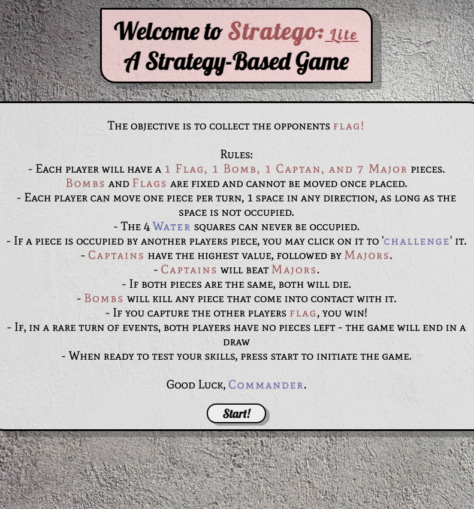
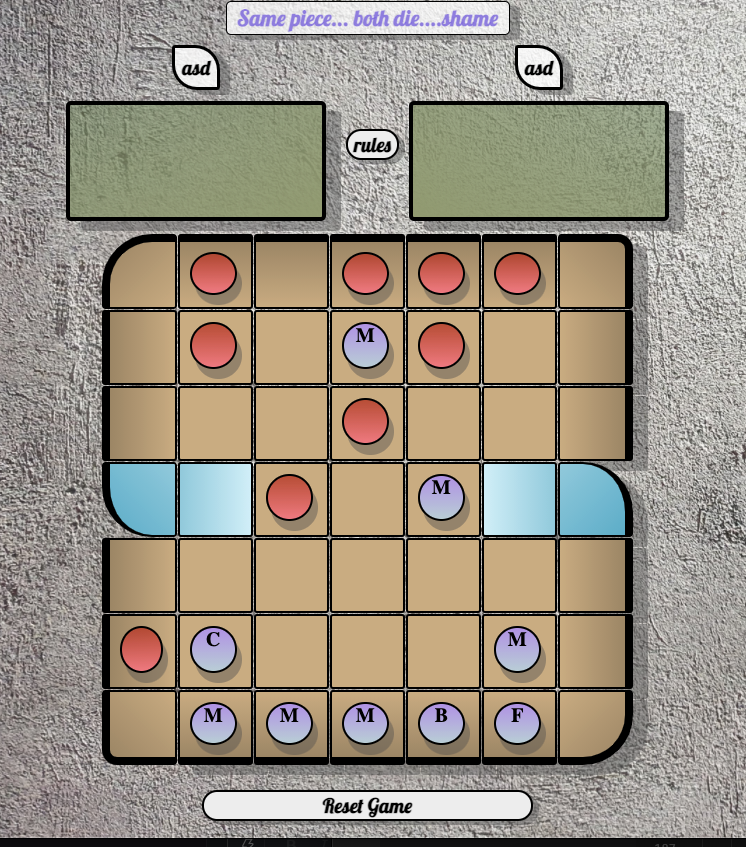
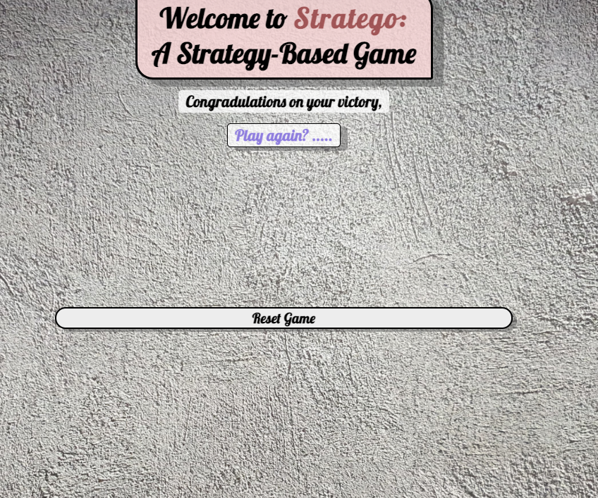
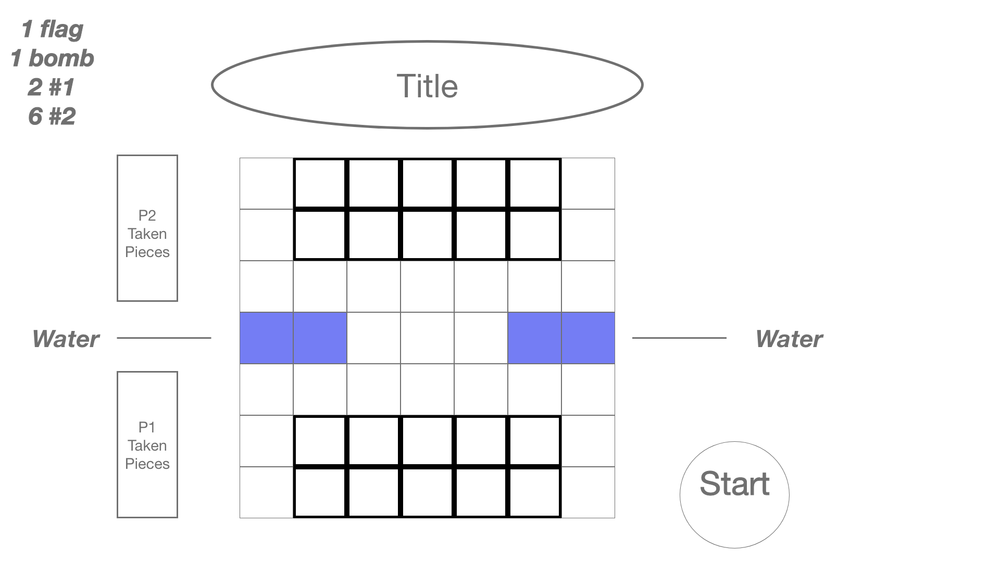
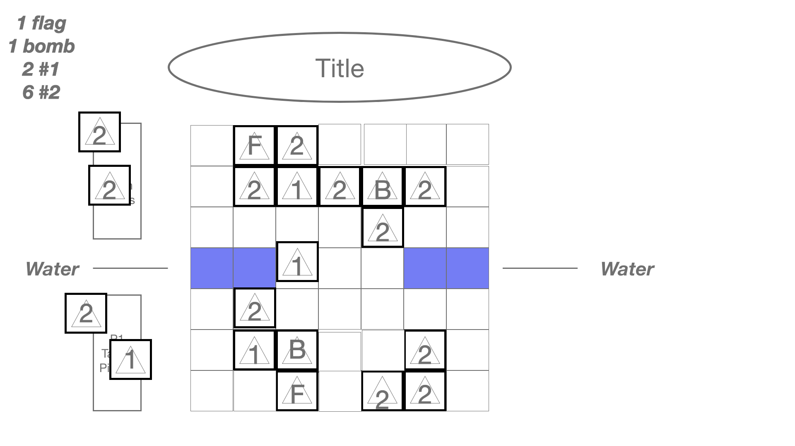
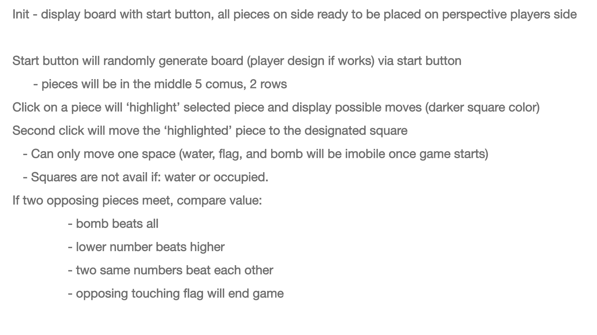

<h1><strong>Welcome to Stratego!</h1>

 
 <h2>Introduction</h2>
    Stratego is a strategy based board game, in which the obhective is to control a set of forces and capture the opponents flag. 
Be careful not to step on their bombs, and if you challenge an opponents piece, be sure that you are a higher rank ;) 
  
   The inspiration for this project comes from my father.
This was the main game that he and i played growing up, as i was learning how to be a human, so what better way to learn to be a programmer but with in the same vein.  

 
<h2>Game Screenshots</h2>
<h3>Start page with rules - rules can also pop up dring gameplay</h3>
 
 

  
<h3>Gameplay</h3>
 

  
   
<h3>Winner message</h3>

 
 
<h2>Wireframe</h2>

<h2>Getting Started</h2>
Try out here: <a href="https://deitz88.github.io/Stratego/" rel="nofollow">Stratego!: Lite</a>
<h2>Technologies Used</h2>
<ul>
 <li>Javscript</li>
 <li>CSS</li>
 <li>HTML</li>
 </ul>
<h3>Rules of Game</h3>
<ol>
 <li>Each player starts with:
  <ul>
   <li>1 Flag> - protect yours, and capture your opponents!<li>
        <ul><li>Cannot be moved once placed and gameplay starts</li></ul>
   <li>1 Bomb</li>
   <ul><li>Bombs also cannot be moved once placed</li></ul>
   <li>1 Captain (highest ranking piece)</li>
   <li>7 Major pieces</li></li></ul>
   <li>A player may move 1 piece in any direction during their turn:
             <ul>
       <li>If the space is unnocupied, piece moves and is next pkayers turn</li>
       <li>If the space is occupied by an opponents piece, you may 'challenge' it
        <ul><li>Bombs beat any piece that touches it</li>
         <li>Captains beat Majors</li>
         <li>If both pieces have the same value, both pieces are lost</li>
         <li>If you select the oponents flag, you win!</li>
         <li>The 4 water squares can never be occupied by any pieces</li>
        </ul></li></ul>
    <li>Each player two minutes to setup their initial pieces, an 45 seconds to move per turn</li>
    <li>The game is over when one of the following conditions is met:
                  <ul><li>A player captures the opposing players flag</li>
                   <li>Neither side has any movable pieces</li></ul>
 </ol>
 
 <h2>Next Steps</h2>
 Given more time and knowledge on this project, i would like to:
 <ol> 
  <li>Create options for different colors of pieces and game boards during start section of the game</li>
 <li>Add a simplistic AI for player VS computer play</li>
 <li>Enlarge the gameboard, and add the full spectrum of pieces and abilities
       <ul>
        <li>Varying pieces 1-9</li>
        <li>8's being able to dig out bombs</li>
        <li>9's being able to move the entire row or coloumn in one turn, challenging forces from afar to learn their piece rank</li>
        <li>Add a 'spy' piece that can take out the #1 (captain( piece, but any other piece can destroy it</li>
  </ul>
 <li>Add animations for movement of pieces</li>
 <li>Add decorations(images) for pieces during current players turn</li>
        
  
